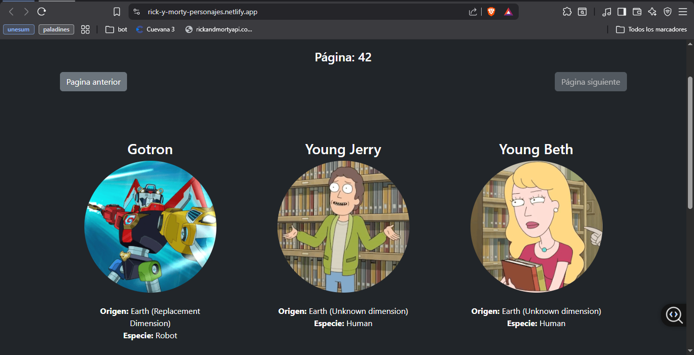

# Rick & Morty Explorer Character Gallerly (React + API)

Este proyecto es una Single Page Application (SPA) construida con React.js que consume la API oficial de Rick and Morty. El objetivo principal fue implementar un flujo de datos asíncrono eficiente y una interfaz de usuario dinámica y responsiva con la implementación de Bootstrap 5.

## Skills and knowleadge

Consumo de datos y asincronía (Fecth API y Async/Away)

## Development and Deployment

**Vite:** Configuración y uso de Vite como herramienta de construcción para un desarrollo más ágil.

**CI/CD & Hosting:** Proceso de compilación de producción y despliegue automatizado en GitHub Pages para su posterior despliegue en **Netlify**.

## Explorer

[Ver Demo en Vivo](https://rick-y-morty-personajes.netlify.app/)
